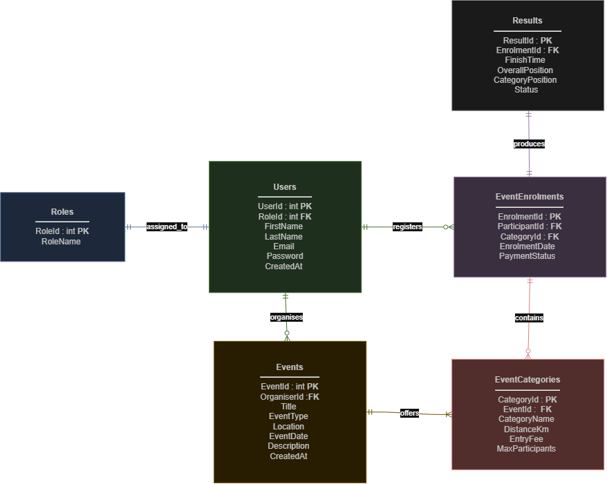

# RaceDay Event Management Platform

## Student Information
* **Full Name:** Ntsako Vuthlari Kubayi
* **Student ID:** ST10470286
* **Module:** PROG6212 - Programming 2B
* **Qualification:** Diploma in Information Technology
* **Campus:** Rosebank College (Braamfontein Campus)
* **Submission Date:** September 2026

## Table of Contents
1. [Project Overview](#project-overview)
2. [Database Schema & ERD](#database-schema--erd)
3. [REST API Endpoint Plan](#rest-api-endpoint-plan)
4. [Database Setup Instructions](#database-setup-instructions)
5. [CI/CD Workflow](#cicd-workflow)
6. [Video Presentation](#video-presentation)

## Project Overview
**RaceDay** is a centralized sports event management platform designed to streamline event organization, athlete registration, and race result tracking across running, walking, and cycling events in South Africa.

### Core Features & Functionality
- **User Roles & Access Control**: Differentiates between Event Organisers and Event Participants.
- **Event Lifecycle Management**: Organisers can publish upcoming events, configure specific distance categories (e.g., 21.1km Half Marathon), set entry fees, and cap maximum participants.
- **Seamless Registration**: Participants can browse upcoming races, register for specific categories, and track payment status.
- **Results Tracking**: Organisers record official finish times and placement rankings (Overall and Category positions) upon race completion.

## Database Schema & ERD
The system relies on a normalized relational SQL Server database (`RaceDayDb`) comprising 6 core entities: `Roles`, `Users`, `Events`, `EventCategories`, `EventEnrolments`, and `Results`.

*Detailed relationship cardinalities and Crow's Foot notation rules can be reviewed in [docs/relationships.md](docs/relationships.md).*
